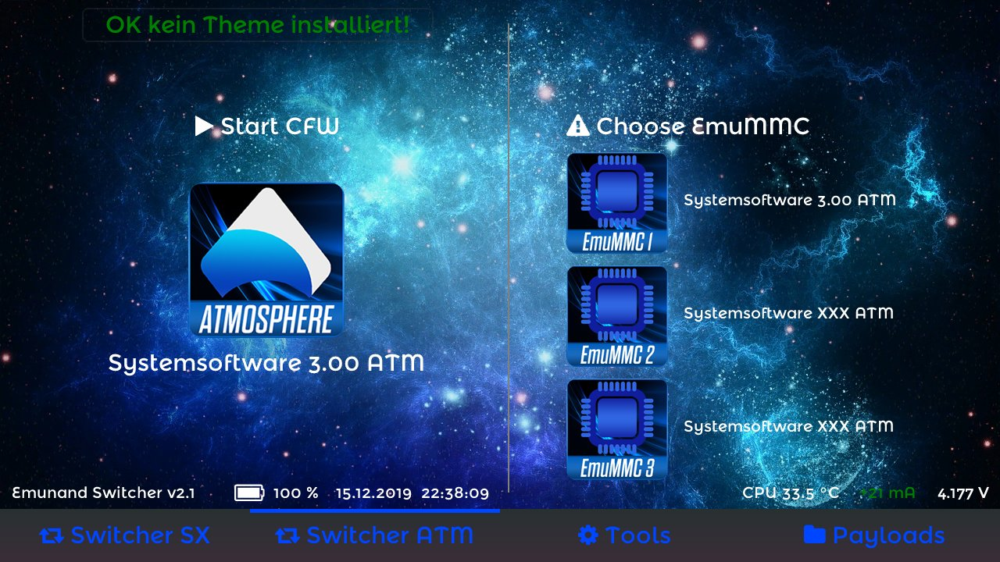
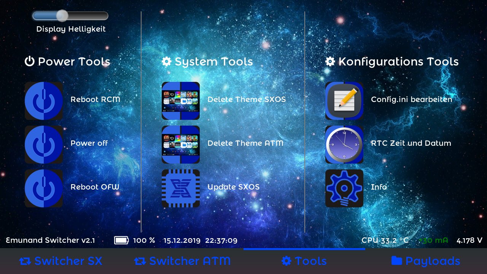
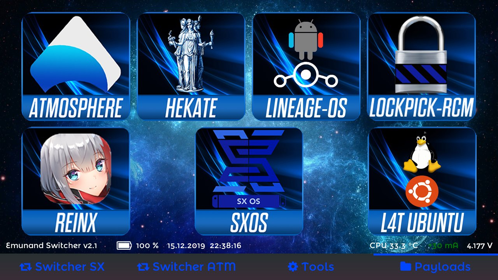

# Emunandswitcher
SXOS and Atmosphere SD Files Emunand/Emummc Switcher and Multitool

Fork from: https://github.com/Guillem96/argon-nx

Vorstellung:

Nach einer Idee, habe ich begonnen diese Payload App zu entwickeln. Die App ist eher für Entwickler und Tester gedacht aber wer es brauchen kann, gerne...
Damit können gleichzeitig maximal drei Emunands auf der SD betrieben und mit ein paar Klicks gewechselt werden. 
Die Emunands und die auf SD installierten Inhalte sind alle von einander getrennt und können mit unterschiedlicher Systemsoftware Versionen upgedatet werden.

Das ganze funktioniert mit SXOS und Atmosphere SD Emunand/Emummc. Es funktioniert auf allen Systemsoftware Versionen (Payload), 
weil es eine RCM App ist und ausgeführt wird bevor irgend ein CFW oder Nintendo Code folgt.

Release 1.1 Änderungen:

- Atmosphere SD emummc integriert
- Möglichkeit die gewünschte CFW beim start auszuwählen
- Neue Ordnerstruktur um besser zwischen SXOS und Atmosphere zu unterscheiden
- Akku Info by mrdude integriert
- LayeredFS und Theme tauglich, Titles Ordner integriert
- Theme Warnung und Möglichkeit Theme zu löschen integriert

Introduction:

After an idea, I started to develop this payload app. The app is rather for developers and testers thought but who can use it, with pleasure...
This can simultaneously operate a maximum of three Emunands on the SD card and be changed with a few clicks.
The Emunands and the content installed on SD are all separate and can be updated with different system software versions.

At the moment this is just for SXOS and Atmosphere SD Emunand/Emummc. It works on all system software versions (payload) because
it is an RCM app and will run before any CFW or Nintendo code follows.

Release 1.1 changes:

- Atmosphere SD emummc integrated
- Possibility to select the desired CFW at startup
- New folder structure to better distinguish between SXOS and Atmosphere
- Battery Info integrated by mrdude
- LayeredFS and Theme compatible, Titles folder integrated
- Theme warning and possibility to delete theme integrated

Release 2.0 Änderungen:

- Ganz neuer GUI, mit Live aktualisierung für Theme info, installierter Emunand Anzeige, Akku-, Datum- und Zeitanzeige.
- Zeit und Datum kommen von der RTC und kann falsch sein! Mit Ubuntu könnte die RTC gesetzt werden, funktioniert dann auch in Hekate richtig.
Fix GMT+1h und mit Sommerzeit Umschaltung.
- Emunand switcher für SXOS und Atmosphere mit den üblichen Funktionen, per Tabs umschaltbar.
- Möglichkeit zum Theme löschen vor dem booten für beide CFWs unter Tools.
- Update Möglichkeit für SXOS, boot.dat z.B. mit nxmtp auf die SD kopieren, dann im RCM Updaten, neu booten fertig
- Payload Loader Argon kompatibel, zeigt die Payloads aus dem argon Ordner an, zwei Reihen Payloads pro Tab

Release 2.0 changes:

- Completely new GUI, with live update for theme info, installed emunand display, battery, date and time display.
- Time and date come from the RTC and can be wrong! With Ubuntu the RTC could be set, works then also in Hekate correctly. Fix GMT + 1h and with summer time switching.
- Emunand switcher for SXOS and Atmosphere with the usual functions, switchable via tabs.
- Ability to delete theme before booting for both CFWs under Tools.
- Update possibility for SXOS, copy boot.dat e.g. with nxmtp on the SD, then in the RCM update, reboot
- Payload Loader Argon compatible, displays the payloads from the argon folder, two rows of payloads per tab

Release 2.1 Änderungen:

- Neuaufbau des Tools Tabs, da zusätzliche Funktionen
- CPU Temperatur Anzeige
- Stromverbrauch in mA und Akkuspannung in V, Anzeige bei laden grün, bei entladen rot
- Möglichkeit die Hellikeit des Displays per Slider einzustellen, die eingestellte Helligkeit wird gespeichert und bei neustart der App automatisch geladen.
- Bearbeiten der Config.ini direkt in der App, nach einem Softwareupdate eines Emunandes kann der Text direkt vor dem booten geändert werden.
- RTC Zeit und Datum setzen!!! Damit kann die Zeit der Realtimeclock eingestellt werden, damit das Datum im Emunandswitcher und hekate richtig angezeigt wird. 
Achtung: Die Zeit im Homemenü der Switch muss danach neu eingestellt werden. Es wird nachher im RCM und Switchmenü die selbe Zeit und Datum angezeigt!

New in Emunandswitcher 2.1:

- Reconstruction of the Tools tab because of additional functions
- CPU temperature display
- Current consumption in mA and battery voltage in V, display green when charging, red when discharging
- Possibility to adjust the brightness of the display using the slider, the set brightness is saved and automatically loaded when the app is restarted.
- Edit the Config.ini directly in the app, after a software update of an Emunand the text can be changed directly before booting.
- Set RTC time and date!!! The time of the real-time clock can be set so that the date is displayed correctly in the Emunandswitcher and hekate.
Attention: The time in the home menu of the switch must then be adjust. Afterwards the same time and date will be shown in the RCM and switch menu!

Erstellt by Storm 2019 mit Visual Studio, LittlevGL und DevKitPro, bassiert auf argonNX und hekate, Icons template von mrdude. Danke an die Programmierer! Danke auch an Gabor für LittlevGL!

Created by Storm 2019 with Visual Studio, LittlevGL and DevKitPro, based on argonNX and hekate, Icons template and some code lines by @mrdude. Thanks to the programmers! Thanks also to Gabor for LittlevGL!

